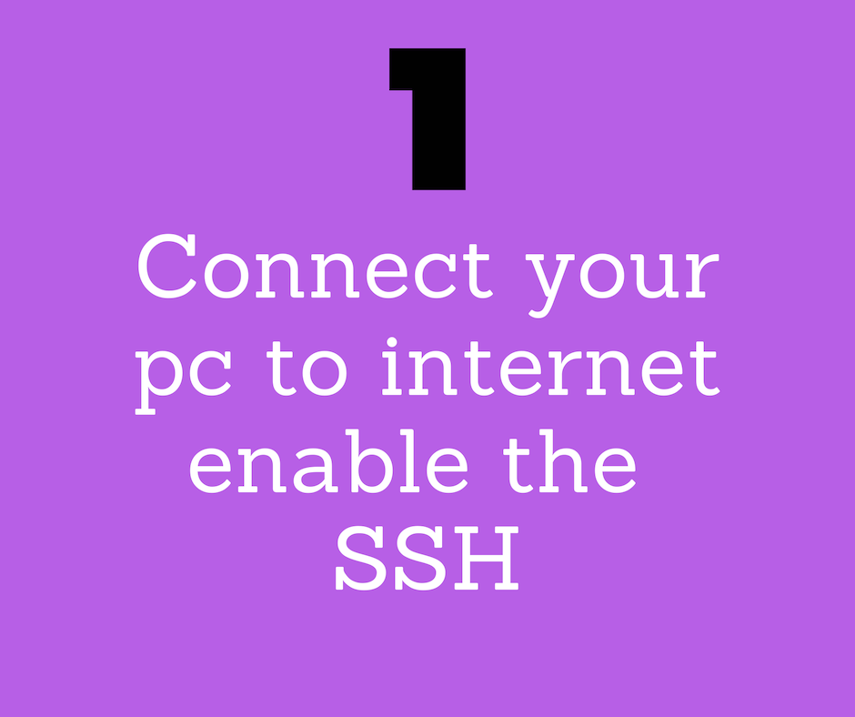

<h3 align="center">
High On Bot 🤖
</h3>

Not Just Any Another Bot

### Features

- Command Line Utility "remotely" via facebook messenger 
- Available on all three platforms [ MacOS, Windows, Linux ]
- 100+ commands right from your phone 

<h3> Demo </h3>
 

<a href="https://inishchith.github.io/highOnBot/Web/index.html"> Read More .. </a>

### How Does it Work ?

> Just 3 easy steps to follow 🚶

| `Connect 🤝`                                                | `Add ➕`                                                    | `Go` ✅                                                     |
| ----------------------------------------------------------- | ----------------------------------------------------------- | ----------------------------------------------------------- |
|  |  |  |

### Installation

> This product is yet to be made public on messenger platform, in case you want to tweak , here are some of the changes that can be made .

### Commands Supported

- [x] Git Commands
- [x] Utility Commands 
- [ ] Many More

### Challenges we ran into :

> The main task that we faced was to gain access to any given PC in the world. Usually for developers Command Line is there life saver and being able to provide that was a challenge. To get the various commands to work properly and presented the given data in readable format was also a challenge. Not to forget to get various files remotely for download via sftp protocol was also needed somewhere which none of us had been experienced in.

* Recognition : [Hack InOut 2018](http://hackinout.co)
